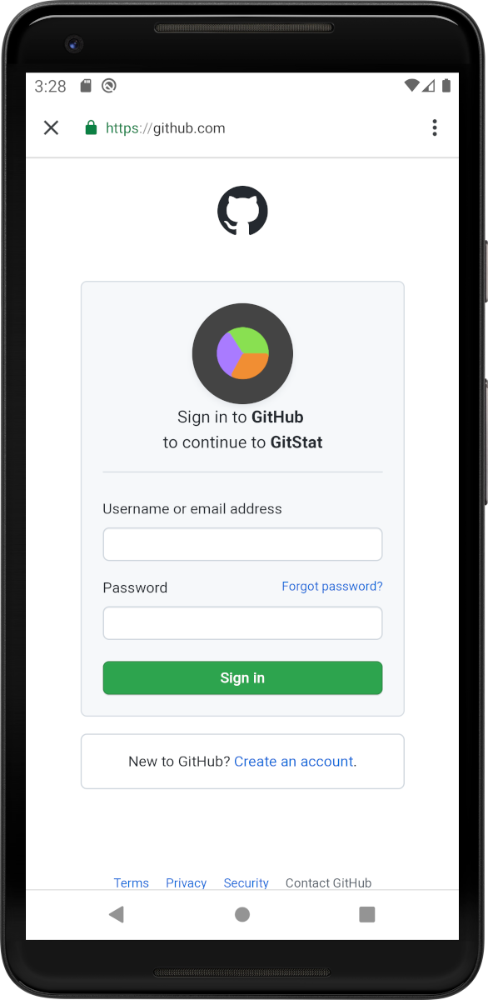

# GitStat

* [Description](#description)
* [Technology (some notes)](#technology-some-notes)
* [Screenshots](#screenshots)
* [Privacy Policy](#privacy-policy)
* [Used tools](#used-tools)

## Description

GitStat is a simple android app designed to aggregate Github profile data into informative cards and graphs.

  

**Major features**:
- Profile summary
- Pie chart with programming languages of your repositories
- List of your repositories with filters and sorting
- Contributions summary
- Charts for contributions (types, count per day, contribution rate)
- Contributions grid (Github-like)

[](https://play.google.com/store/apps/details?id=by.alexandr7035.gitstat)

## Technology (some notes)

- Used single activity approach and [Navigation component](https://developer.android.com/guide/navigation) (with SafeArgs) to navigate across fragments.
- Used [Hilt](https://dagger.dev/hilt/) for dependency injection.
- [View binding](https://developer.android.com/topic/libraries/view-binding) is used to interact with views within fragments and recyclerview adapters.
- Kotlin coroutines are used for asynchronous operations.
- [Apollo Android](https://github.com/apollographql/apollo-android) ([Retrofit](https://github.com/square/retrofit) before v3.0) is used to perform [Github API](https://docs.github.com/en/rest) calls to obtain the data. Also use [OkHttp Logging Interceptor](https://github.com/square/okhttp/tree/master/okhttp-logging-interceptor) to log requests.
- [Room](https://developer.android.com/jetpack/androidx/releases/room) database is used for cache implementation.
- Google's [FlexboxLayout](https://github.com/google/flexbox-layout) as LayoutManager and custom checkable LinearLayout are 
used to implement languages filter (see third screenshot).
- [CircleImageView](https://github.com/hdodenhof/CircleImageView) and [Picasso](https://github.com/square/picasso) libs are involved to obtain and display user profile image.
- [MPAndroidChart](https://github.com/PhilJay/MPAndroidChart) library is used for plots and diagrams in the application.
- Use [Timber](https://github.com/JakeWharton/timber) logging in order to prevent log calls removal before every release building.
- Use [Firebase Crashlytics](https://firebase.google.com/products/crashlytics) to catch and fix crashes.
- Use [Firebase Authentication](https://firebase.google.com/products/auth) to implement Github Oauth authorization.

## Screenshots

<p align="left">



</p>

<p align="left">


</p>

## Privacy Policy
- We use **Github Oauth** (Firebase) for user authentication. As soon as you click the login button, system opens the browser.  You have to enter the login and password from your **Github account**.
- As **Oauth** method is used for authentication, even if you log out, you may be able log in again without entering your Github login and password. If this is wrong behavior for you, clear your browser cache after logging out.
- We get access to ```read:user``` and ```repo``` access scopes. We **do not perform any write operations** on your github account. Full ```repo``` scope is used only to have access to your private repos data and not to perform malicious write operations.
- We do not store your account data anywhere outside the device local storage.

## Used tools
- Used [Avocado](https://github.com/alexjlockwood/avocado) to optimize vector drawables drawn in Figma.
- Used [gh-md-toc](https://github.com/ekalinin/github-markdown-toc) to create table of contents for this README.

