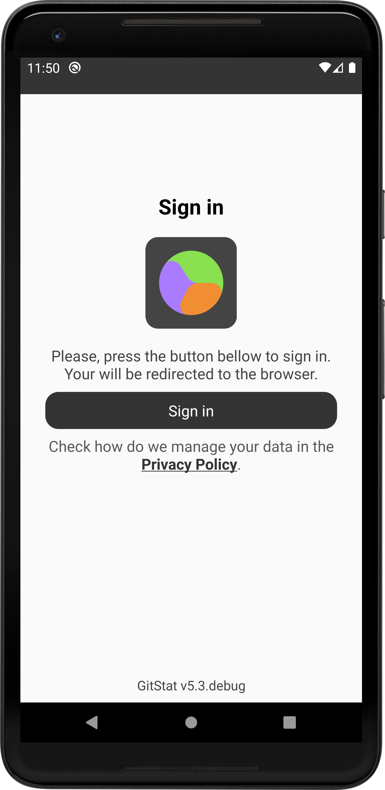
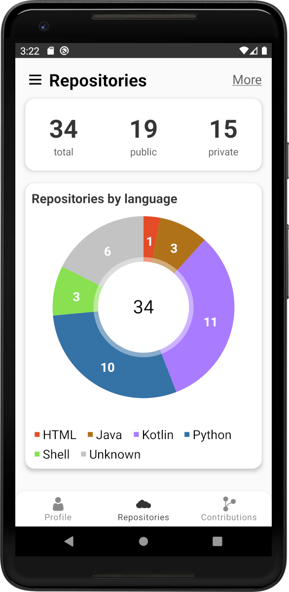
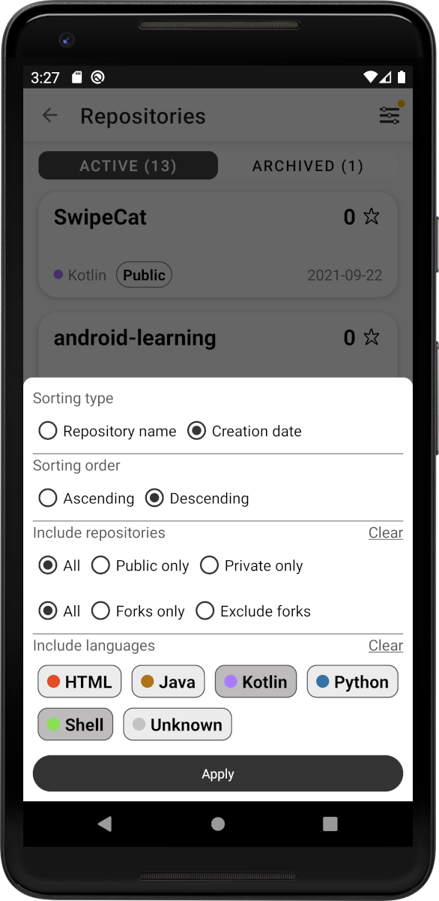
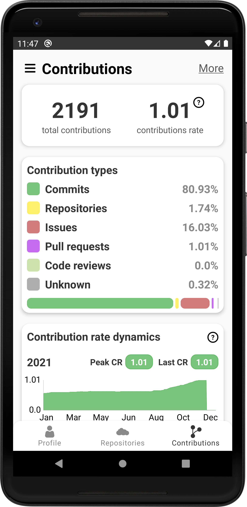

# GitStat
GitStat is a simple android app designed to aggregate Github profile data into informative cards and graphs.


## Screenshots

<p align="left">



</p>

<p align="left">



</p>


## Technology (some notes)

- Used single activity approach and [Navigation component](https://developer.android.com/guide/navigation) to navigate across fragments.
- Used [Hilt](https://dagger.dev/hilt/) for dependency injection.
- [View binding](https://developer.android.com/topic/libraries/view-binding) is used to interact with views within fragments and recyclerview adapters.
- Kotlin coroutines are used for asynchronous operations.
- [Apollo Android](https://github.com/apollographql/apollo-android) ([Retrofit](https://github.com/square/retrofit) before v3.0) is used to perform [Github API](https://docs.github.com/en/rest) calls to obtain the data. Also use [OkHttp Logging Interceptor](https://github.com/square/okhttp/tree/master/okhttp-logging-interceptor) to log requests.
- [Room](https://developer.android.com/jetpack/androidx/releases/room) database is used for cache implementation.
- Google's [FlexboxLayout](https://github.com/google/flexbox-layout) as LayoutManager and custom checkable LinearLayout are 
used to implement languages filter (see third screenshot).
- [CircleImageView](https://github.com/hdodenhof/CircleImageView) and [Picasso](https://github.com/square/picasso) libs are involved to obtain and display user profile image.
- [MPAndroidChart](https://github.com/PhilJay/MPAndroidChart) library is used for plots and diagrams in the application.
- Use [Timber](https://github.com/JakeWharton/timber) logging in order to prevent log calls removal before every release building.


## How to authorize
- Download APK from the [releases](https://github.com/alexandr7035/gitstat/releases) page and install it.
- Go to [Personal access tokens](https://github.com/settings/tokens) section in your Github profile settings.
- Create personal access token with ```read:user``` and ```repo``` access scopes. (**Note**: full ```repo``` scope is used only to have access to your private repos data. No malicious write operations are performed by the app).
- Use the obtained token as auth credential in the application login form.

More user-friendly **OAuth** method may be implemented later.
